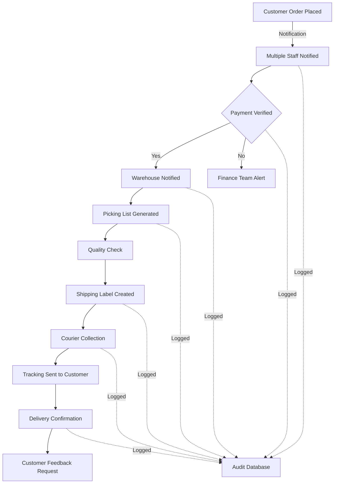

# Shopify Platform Configuration - Transparent Operations

## Platform Setup (Historical Healthy State)

### Store Configuration

#### Multi-User Access Structure
```
Store Owner Account
├── Full Administrative Access
├── Financial Overview Access
├── Customer Data Management
└── System Configuration Rights

Manager Accounts (Multiple)
├── Product Management
├── Order Processing
├── Customer Service
└── Inventory Updates

Staff Accounts
├── Order Fulfillment
├── Basic Product Updates
└── Customer Inquiries
└── Shipping Management

Financial Oversight Account
├── Revenue Reports Access
├── Transaction History
├── Tax Documentation
└── Reconciliation Data

Auditor Read-Only Account
├── Complete Transaction Logs
├── Customer Data Audit
├── Compliance Reports
└── System Activity Logs
```

### Integrated Applications

#### 1. Accounting Integration
- **QuickBooks/Sage Integration**
  - Automatic transaction sync
  - Daily revenue reconciliation
  - Tax calculation automation
  - Multi-currency support
  - Cost of goods tracking

#### 2. Email Marketing via regima.zone
- **Klaviyo/Mailchimp Integration**
  - Customer segmentation
  - POPIA-compliant opt-ins
  - Campaign performance tracking
  - Automated flows with consent
  - Unsubscribe management

#### 3. Inventory Management
- **Real-time Stock Sync**
  - Warehouse location tracking
  - Low stock alerts to multiple users
  - Automated reorder points
  - Supplier integration
  - Barcode scanning support

#### 4. Customer Support Portal
- **Zendesk/Freshdesk Integration**
  - Ticket creation from orders
  - Customer history access
  - Team collaboration tools
  - SLA tracking
  - Knowledge base integration

### Transparency Features

#### 1. Dashboard Visibility
```javascript
// Custom Dashboard Configuration
const transparencyDashboard = {
  widgets: [
    {
      type: 'revenue_tracker',
      visibility: ['owner', 'manager', 'accountant'],
      refresh: 'real-time'
    },
    {
      type: 'order_flow',
      visibility: ['all_staff'],
      alerts: true
    },
    {
      type: 'customer_communications',
      visibility: ['owner', 'manager', 'support'],
      includes: 'email_logs'
    },
    {
      type: 'inventory_levels',
      visibility: ['all_users'],
      warnings: 'low_stock'
    },
    {
      type: 'financial_summary',
      visibility: ['owner', 'accountant', 'auditor'],
      period: 'daily'
    }
  ]
};
```

#### 2. Automated Reporting

**Daily Reports (Sent via regima.zone)**
- Sales summary to all stakeholders
- New customer acquisitions
- Inventory movements
- Customer service metrics
- Financial reconciliation status

**Weekly Analytics**
- Revenue trends analysis
- Product performance metrics
- Customer lifetime value
- Marketing campaign ROI
- Operational efficiency KPIs

**Monthly Compliance Reports**
- POPIA compliance checklist
- Data subject requests handled
- Security incident log
- Consent management updates
- Audit trail summaries

### Order Processing Workflow



### Security Configuration

#### Access Control
- Two-factor authentication required
- IP whitelisting for admin access
- Session timeout after 30 minutes
- Password complexity requirements
- Regular access reviews

#### Data Protection
- SSL certificates on all domains
- PCI compliance for payments
- Encrypted customer data
- Regular security scans
- Automated backups

### API Integrations

```yaml
integrations:
  accounting:
    provider: "QuickBooks"
    sync_frequency: "real-time"
    data_shared:
      - orders
      - customers
      - products
      - refunds
      - taxes
    
  email:
    provider: "SendGrid"
    domain: "regima.zone"
    features:
      - transactional_emails
      - marketing_campaigns
      - customer_notifications
      - order_confirmations
      - shipping_updates
    
  warehouse:
    provider: "Custom WMS"
    sync_type: "bidirectional"
    updates:
      - stock_levels
      - location_tracking
      - pick_lists
      - shipping_status
    
  logistics:
    providers:
      - "DHL"
      - "FedEx"
      - "Local Couriers"
    features:
      - rate_shopping
      - label_printing
      - tracking_updates
      - delivery_confirmation
```

### Compliance Features

#### POPIA Compliance Tools
1. **Consent Management**
   - Explicit opt-in forms
   - Granular consent options
   - Consent withdrawal mechanism
   - Audit trail of consent

2. **Data Subject Rights**
   - Self-service data access
   - Correction request forms
   - Deletion request handling
   - Data portability tools

3. **Privacy by Design**
   - Minimal data collection
   - Purpose limitation
   - Data anonymization
   - Retention policies

### Financial Transparency

#### Payment Processing
- Multiple payment gateways
- Transaction fee transparency
- Automated reconciliation
- Fraud detection
- Chargeback management

#### Revenue Visibility
```
Daily Revenue Dashboard
├── Gross Sales
├── Refunds & Returns
├── Net Revenue
├── Payment Method Breakdown
├── Tax Collected
├── Shipping Revenue
└── Platform Fees
```

### Benefits of Proper Configuration

1. **Multi-Stakeholder Access**: Everyone who needs information has it
2. **Audit Trail**: Complete history of all actions
3. **Compliance**: Meets all regulatory requirements
4. **Efficiency**: Automated workflows reduce manual work
5. **Transparency**: No hidden operations or data
6. **Scalability**: System grows with business
7. **Reliability**: Multiple backups and redundancies

This configuration represents the gold standard for transparent e-commerce operations and must be restored.