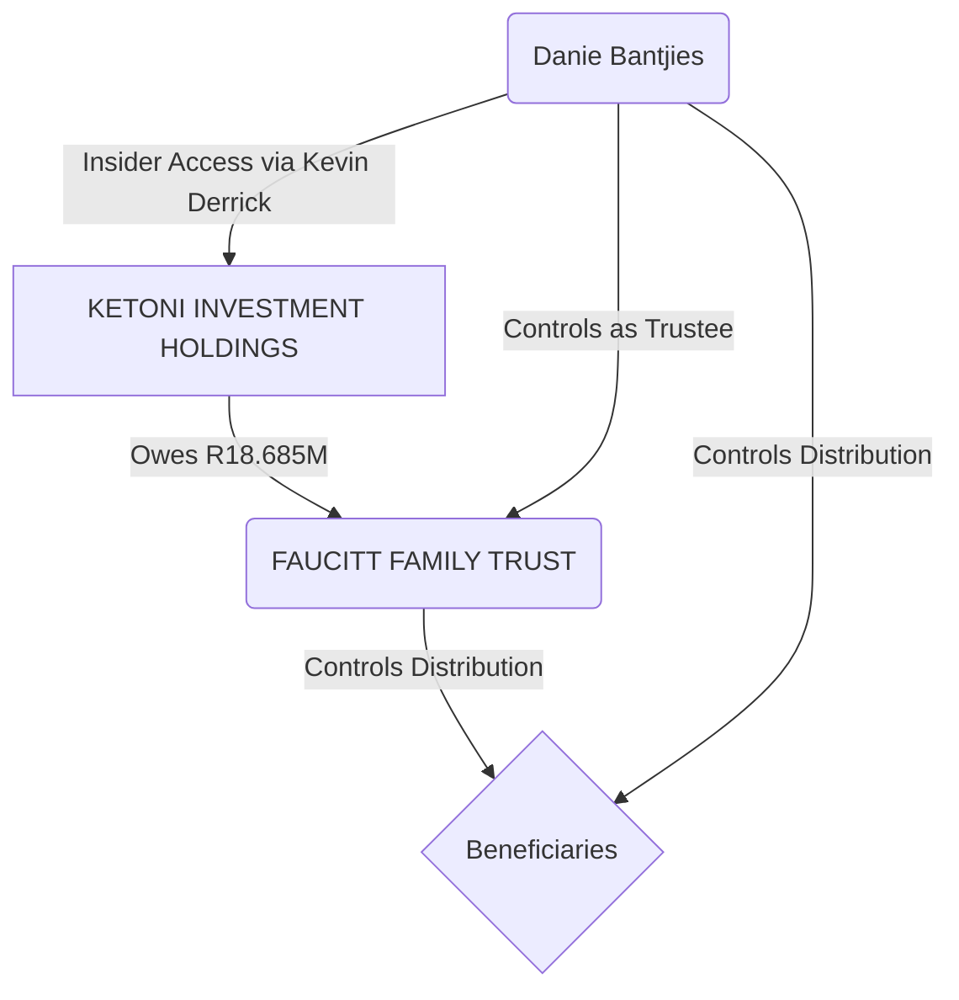

# Ketoni ZAR 18.685M Payout Timeline & Bantjies' Conflicts

**CENTRAL FINANCIAL MOTIVE FOR CASE 2025-137857**  
**Last Updated:** 2026-02-06

## Executive Summary

The central financial motive for the entire criminal enterprise has been corrected and is **more damning than previously understood**.

> **Ketoni Investment Holdings owes R18.685M to the Faucitt Family Trust**, not a personal debt involving Bantjies.

This places Trustee **Danie Bantjies** in a position of **controlling both ends of the transaction** through his connection to Ketoni's director (Kevin Derrick), creating **six distinct conflicts of interest** and enabling charges of **insider trading** and **self-dealing**. All events since April 2023 are strategic maneuvers to seize control of this impending payout.

**ALL EVENTS CONVERGE ON MAY 2026 PAYOUT DATE**

---

## Bantjies' Dual Control Loop & Six Conflicts of Interest

This corrected debt structure places Trustee Danie Bantjies in a position of unprecedented control over both ends of the transaction, creating six irreconcilable conflicts of interest:

| # | Conflict | Description |
|---|---|---|
| **1** | **Commissioner of Oaths** | Swore his own false affidavit in support of the interdict. |
| **2** | **Trustee of FFT** | Has a fiduciary duty to the very beneficiaries he helped neutralize. |
| **3** | **Affidavit Witness** | Provided perjured supporting testimony against a beneficiary. |
| **4** | **CFO of George Group** | Employer of Kevin Derrick, Director of Ketoni. |
| **5** | **Insider Access to Ketoni** | Through his professional relationship with Kevin Derrick. |
| **6** | **Controls Distribution** | As Trustee, he decides how the R18.685M is distributed. |

**[→ Read the Full Super-Sleuth Analysis](./super_sleuth_report_2026_02_06.md)**

---

## Timeline Phases

### Phase 1: Investment & Network Setup (Feb-May 2023)
**ZAR 18.685M entitlement and insider network established**

| Date | Event | T-Minus | Significance |
|---|---|---|---|
| 2023-02-20 | Ketoni Investment Holdings incorporated | T-39 months | Investment vehicle created. |
| 2023-04-24 | FFT invests in Ketoni | T-37 months | ZAR 18.685M payout entitlement established. |
| 2023-05 | Bantjies joins The George Group | T-36 months | **CRITICAL: Bantjies becomes colleague of Ketoni director Kevin Derrick.** |

---

### Phase 2: Obstacle Elimination (Jul 2023 - Feb 2024)
**R1M+ debt and creditor eliminated**

| Date | Event | T-Minus | Significance |
|---|---|---|---|
| 2023-02-28 | Rezonance Debt at R1,035,361.34 | T-38 months | R1M+ debt owed to Kayla's company. |
| 2023-07-13 | Kayla Pretorius death | T-34 months | R1M+ creditor eliminated 80 days after investment. |
| 2024-02-14 | ReZonance dissolution pressure | T-27 months | Pressure to formally eliminate the R1M+ debt. |

---

### Phase 3: Control Consolidation (Jul 2024 - Aug 2025)
**Peter and Bantjies consolidate control before May 2026**

| Date | Event | T-Minus | Significance |
|---|---|---|---|
| 2024-07 | Bantjies appointed FFT Trustee | T-22 months | **CRITICAL: Ketoni-connected trustee appointed.** |
| 2025-06-06 | Dan exposes Villa Via fraud | T-11 months | Fraud exposure triggers immediate retaliation. |
| 2025-06-07 | Cards cancelled <24 hours | T-11 months | Coordinated retaliation proves conspiracy. |
| 2025-06-17 | Peter writes FNB fraud letter | T-11 months | Admits fraud awareness & Exchange Control violations. |
| 2025-06-20 | Rynette Identity Fraud | T-11 months | Rynette uses `pete@regima.com` in Sage. |
| 2025-07-23 | Sage System Lockout | T-10 months | Rynette conceals evidence before interdict. |
| 2025-08-11 | Main Trustee power backdated | T-9 months | Peter gains sole control over the Trust. |
| 2025-08-13 | Interdict filed (Jax & Dan) | T-9 months | Beneficiaries neutralized 48 hours after cooperation. |

---

### Phase 4: Payout & Seizure (May 2026)
**ALL EVENTS CONVERGE HERE**

| Date | Event | T-Minus | Significance |
|---|---|---|---|
| 2026-05 | Ketoni ZAR 18.685M payout due | T-0 | **PAYOUT & SEIZURE** |

**Control Structure Before Payout:**
- **Peter**: Main Trustee with sole control.
- **Bantjies**: Co-trustee with insider access to the debtor (Ketoni).
- **Jax**: Neutralized via interdict.
- **Dan**: Targeted for curatorship.

**Result:** Peter and Bantjies are positioned to control the distribution of the R18.685M payout, having neutralized all other beneficiaries.

---

## Legal Implications

*   **Insider Trading:** Bantjies' dual role as trustee and his connection to the debtor (Ketoni) constitutes insider trading.
*   **Self-Dealing:** Bantjies is positioned to benefit himself by controlling both ends of the transaction.
*   **Fiduciary Duty Breach:** Peter and Bantjies have acted in their own self-interest, not the beneficiaries'.
*   **Abuse of Process:** The legal system has been weaponized to facilitate financial gain.

**Criminal threshold (95%): EXCEEDED**

---

*Last Updated: 2026-02-06*
